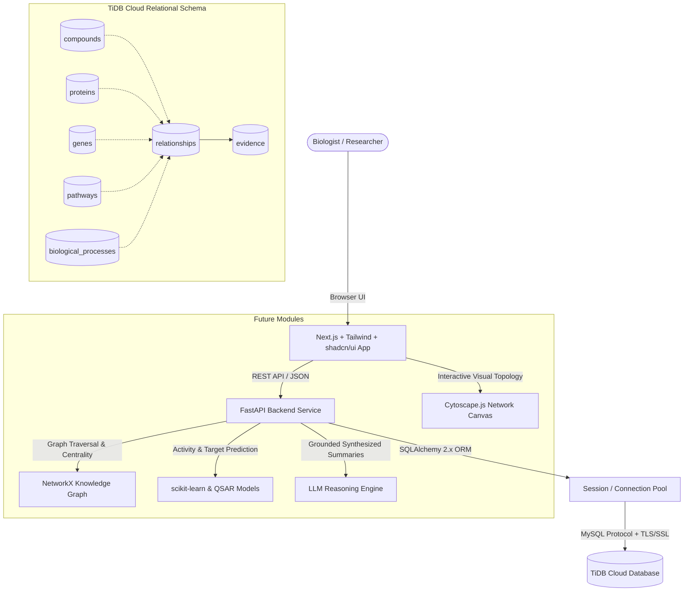

# BioNexus Architecture

BioNexus is a multi-tiered, evidence-driven biological discovery platform designed to connect natural compounds (e.g. microbial secondary metabolites from *Streptomyces*, phytochemicals) to their biological targets, pathways, and phenotypic actions.



---

## 1. System Components & Data Flow

```
Frontend (Next.js 14 / TypeScript / Tailwind CSS)
   ↓ (REST API / HTTP JSON)
FastAPI Backend (app.main / API Router)
   ↓ (Session Dependency Injection: get_db)
SQLAlchemy 2.x ORM & PyMySQL Connection Pool (pool_pre_ping=True)
   ↓ (MySQL Protocol over TLS/SSL on Port 4000)
TiDB Cloud (Distributed Distributed SQL Database)
```

---

## 2. Relational Database Schema

The BioNexus relational database schema in TiDB Cloud consists of 7 normalized tables:

### 1. `compounds`
Stores chemical and topological information for natural compounds and secondary metabolites.
- `id` (BigInteger PK, Auto-increment)
- `name` (String(255), Index): Common name (e.g. *Capreomycin*, *Curcumin*).
- `canonical_id` (String(100), Unique Index): Standard identifier (e.g. `CHEMBL25`, `SMR00001`).
- `pubchem_cid` (BigInteger, Index): PubChem Compound Identification number.
- `smiles` (Text): Simplified Molecular Input Line Entry System string.
- `molecular_weight` (Float): Molecular mass in g/mol.
- `created_at` (DateTime): Timestamp of entity creation.

### 2. `proteins`
Stores biological protein entities, receptors, and enzymes.
- `id` (BigInteger PK, Auto-increment)
- `name` (String(255), Index): Full protein name (e.g. *Epidermal Growth Factor Receptor*).
- `canonical_id` (String(100), Unique Index): UniProt accession (e.g. `P00533`).
- `created_at` (DateTime): Timestamp of entity creation.

### 3. `genes`
Stores gene entities encoding proteins or regulatory elements.
- `id` (BigInteger PK, Auto-increment)
- `name` (String(255), Index): Gene symbol / name (e.g. `EGFR`, `TP53`).
- `canonical_id` (String(100), Unique Index): NCBI Gene ID or Ensembl identifier.
- `created_at` (DateTime): Timestamp of entity creation.

### 4. `pathways`
Stores biological signaling, metabolic, and regulatory pathways.
- `id` (BigInteger PK, Auto-increment)
- `name` (String(255), Index): Pathway title (e.g. *Signaling by EGFR*).
- `canonical_id` (String(100), Unique Index): Reactome / KEGG accession (e.g. `R-HSA-177929`).
- `created_at` (DateTime): Timestamp of entity creation.

### 5. `biological_processes`
Stores higher-order physiological processes and cellular events.
- `id` (BigInteger PK, Auto-increment)
- `name` (String(255), Index): Process description (e.g. *Apoptotic process*).
- `canonical_id` (String(100), Unique Index): Gene Ontology Biological Process ID (e.g. `GO:0006915`).
- `created_at` (DateTime): Timestamp of entity creation.

### 6. `relationships`
The central graph relationship table linking biological entities across domains.
- `id` (BigInteger PK, Auto-increment)
- `source_type` (String(50), Index): Type of source entity (`compound`, `protein`, `gene`, `pathway`).
- `source_id` (BigInteger, Index): Primary key of the source entity.
- `relationship_type` (String(100), Index): Action or association (`inhibits`, `activates`, `binds`, `regulates`, `part_of`).
- `target_type` (String(50), Index): Type of target entity (`protein`, `gene`, `pathway`, `biological_process`).
- `target_id` (BigInteger, Index): Primary key of the target entity.
- `created_at` (DateTime): Timestamp of relationship creation.

*Common relationship pairings:*
- Compound → Protein (e.g. *Inhibition*, *Binding*)
- Protein → Gene (e.g. *Encoded by*)
- Gene → Pathway (e.g. *Participates in*)
- Gene → Biological Process (e.g. *Involved in*)

### 7. `evidence`
Stores provenance, literature references, and confidence metrics backing each relationship. BioNexus requires rigorous evidence grounding.
- `id` (BigInteger PK, Auto-increment)
- `relationship_id` (BigInteger FK -> `relationships.id`, ondelete="CASCADE"): Linked relationship.
- `source_database` (String(100), Index): Literature or curated database source (e.g. `PubMed`, `StreptomeDB`, `ChEMBL`).
- `source_record_id` (String(100), Index): Specific accession or publication ID (e.g. PMID `28479212`).
- `evidence_type` (String(100)): Methodology (e.g. `experimental_assay`, `clinical_trial`, `curated_literature`).
- `confidence` (Float): Confidence or affinity score (0.0 to 1.0).
- `source_url` (String(500)): Direct URL to source citation or database entry.
- `retrieved_at` (DateTime): Timestamp of data retrieval.

---

## 3. Database Initialization & Migration

Database tables are created using the modular initialization script:
```bash
python -m app.db.init_db
```
This executes `Base.metadata.create_all()` without dropping or resetting existing tables. When the project transitions to production schemas, migrations will be managed with Alembic.
